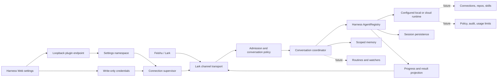

# Deepseek Tag parity roadmap

This document is the implementation ledger for converging on Claude Tag. It is
based on Anthropic's public Claude Tag documentation as of 2026-08-14, the
official DeepSeek Harness plugin and service contracts, and the Feishu/Lark
channel implementation listed under [References](#references).

The goal is behavioral parity where Slack and Lark have equivalent primitives,
not a literal copy of Slack-specific administration.

## Architecture

The stable boundaries are:

- **Transport:** `@larksuite/channel` owns WebSocket lifecycle, normalized
  events, reply targets, deduplication, policy gates, and outbound safety.
- **Conversation:** Lark DM/chat/thread identity maps to an opaque Harness
  session identity. Transport IDs never enter prompts except sender display
  context, and runtime configuration participates in the session fingerprint.
- **Runtime:** Harness `AgentRegistry` is the execution boundary. Local versus
  cloud execution remains a Harness composition choice (sandbox, tools, model,
  and workspace plugins), rather than a second agent loop inside Deepseek Tag.
- **Control plane:** non-secret configuration belongs to the `deepseek-tag`
  settings namespace and crosses the Web boundary through a same-origin,
  loopback-only plugin route because Harness does not expose third-party
  namespaces through its generic settings API. App Secret values belong only
  to `credentials`.
- **Projection:** Agent events will be projected into acknowledgment, progress,
  tool activity, final response, and artifacts without coupling Lark rendering
  to the Agent loop.
- **Durable state:** session history uses Harness persistence. Place memory uses
  a schema-validated Harness storage domain; routines, subscriptions, and audit
  records will get their own explicit stores instead of being hidden in prompts
  or process globals.

Do not add a plugin-level runtime abstraction until a second execution backend
needs behavior that Harness `AgentRegistry` cannot express. The registry is the
current production seam and already supports whichever local or cloud runtime
the active Web profile composes.

## Phase 1: usable conversation bridge

| Capability | Status | Implementation |
| --- | --- | --- |
| Installable Harness bundle | Done | `dsh.bundle.patch`, disabled-by-default Cordis row, self-contained `prepare` build |
| Dedicated Web configuration | Done | `dsh.client` browser plugin under **Settings > Deepseek Tag** |
| Secret-safe setup | Done | App Secret is write-only through Harness credentials; UI reads configured/writable facts only |
| Local and cloud-hosted Web runtime | Done | Outbound WebSocket needs no inbound public webhook; Agent execution stays in the composed Harness runtime |
| DM conversation | Done | One durable Agent session per DM chat |
| Group conversation | Done | Direct mention required by default; one session per topic/reply tree |
| Thread continuation | Done | Once a topic/reply tree owns a durable session, admitted members can continue without mentioning the bot again |
| Multi-turn context | Done | Every turn resumes one durable thread session while its live Agent is released after idle |
| Runtime lifecycle | Done | One Agent/sandbox activation per request; `AgentHandle.dispose()` releases the live scoped world while session persistence retains the thread |
| Place memory | Done | DM isolation, private-group writes, read-only workspace inheritance, and explicit workspace-sharing groups over a durable storage domain |
| Final text response | Done | Last visible assistant message from the completed turn is sent back to the originating Lark message |
| Access policy | Done | DM modes plus DM-user and group-chat allowlists are enforced by the channel SDK |
| Hot configuration | Done | Serialized reconnect, credential rotation, and restoration of the previous good config after a failed replacement |
| Reconnect and delivery safety | Done | SDK keepalive/reconnect, deduplication, per-chat queueing, timeout, proxy, and outbound safety remain enabled |
| Feishu and global Lark | Done | Region selector chooses the correct API domain |
| Live app credential validation | Requires deployment check | Needs a real tenant App ID/App Secret; automated tests and a real Harness Web load cannot prove tenant permissions |

Phase 1 intentionally returns a final text reply. Files are disclosed as not
yet consumed instead of being silently ignored. QR onboarding, connection
health, progress cards, commands, and attachments begin the parity work below.

## Phase 2 feature ledger

The order column is dependency order, not a promise that unrelated rows must
ship in one release. Every row is intended to land as a production-usable
commit with focused tests and migration-safe settings.

| Order | Claude Tag behavior to match | Deepseek Tag implementation target | Main extension boundary |
| ---: | --- | --- | --- |
| 1 | Guided workspace pairing/setup | QR PersonalAgent registration in Web UI, manual-credential fallback, cancellation and expiry handling | Control plane + `registerApp` |
| 2 | Setup/test and troubleshooting feedback | Live connection state, bot identity, last transport error, permission diagnostics, send/receive self-test | Transport status projection |
| 3 | Immediate acknowledgment and visible work checklist | Reply with a Lark card, project Agent todo/step state, update in place, finish with final status | Agent event projection |
| 4 | Steering a task while it is running | Accept thread follow-ups during a run, distinguish steering from queued next-turn messages, expose stop/restart | Conversation coordinator |
| 5 | Exact user commands | Implement deterministic `!restart`, `!mute`, `!unmute`, feedback, routine listing, and thread handoff equivalents before normal prompting | Command router |
| 6 | Mention, continuation, auto-response, and mute rules | **Continuation done:** initial mention plus no re-mention inside owned threads. Per-chat automatic-response and mute settings remain. | Admission policy |
| 7 | Files and images in prompts | Authenticated download, size/type limits, Harness attachment ingestion, cleanup, and explicit unsupported-type errors | Transport ↔ attachment service |
| 8 | Rich final outputs | Lark files/cards plus Harness deliverables for documents, charts, hosted pages, and repository links | Result/artifact projection |
| 9 | Model choice per thread/channel/DM | Model picker and commands with precedence: turn → thread → chat → Web profile default; validate against Harness catalog | Runtime policy + settings |
| 10 | Per-channel customization/instructions | Scoped instructions, response behavior, workspace, runtime preset, and version with explicit inheritance | Scope configuration store |
| 11 | Shared multi-user thread session | Preserve actor attribution, let any admitted member steer, serialize conflicting actions, record who changed what | Conversation coordinator + audit |
| 12 | Channel memory | **Core done:** remember/list/update/forget tool, workspace sharing, private-chat isolation. Admin review/delete UI remains. | Scoped memory store + prompt section |
| 13 | Dedicated agent identity | Separate application identity from invoking user; service-account credentials scoped to org/workspace/private chat equivalents | Identity and access bundles |
| 14 | DM personal identity/connectors | Optional per-user connector resolution for DMs without leaking personal credentials into group sessions | User credential scope |
| 15 | Connections and custom MCP servers | Admin-managed connection catalog, dedicated accounts, typed credential forms, MCP registration, allowed hosts | Harness tools/MCP + credentials |
| 16 | Repository access and agent-authored PRs | Repository allowlist, checkout/setup policy, bot/service identity commits and PRs, link back to source Lark thread | Workspace/runtime provisioning |
| 17 | Organization skills repository | Read/sync scoped skills and let the Agent propose skill changes through reviewable PRs | Harness skill service + repo connection |
| 18 | Scheduled routines | Create/list/pause/delete schedules from a chat; durable ownership, timezone, retry, idempotency, and result delivery | Harness jobs + routine store |
| 19 | Channel watching | Event-driven watch rules with deduplication, rate limits, quiet hours, and explainable trigger state | Lark event subscriptions + jobs |
| 20 | Pull-request subscriptions | Subscribe/unsubscribe from a thread, consume provider events, post state transitions and requested follow-ups | SCM connection + webhook/event worker |
| 21 | Proactive follow-up and stalled-thread checks | Durable delayed checks, completion notifications, actor tagging, cancellation when the condition clears | Jobs + conversation state |
| 22 | Ephemeral isolated sandboxes with durable thread state | **Lifecycle done:** idle disposal and durable resume. Per-scope runtime selection and cloud isolation remain; local Harness sandbox is policy confinement, not a microVM. | Harness sandbox/runtime composition |
| 23 | Default-deny network and Agent Proxy | Per-connection host allowlists, SSRF-safe egress, optional fixed proxy/egress, blocked-destination diagnostics | Sandbox network policy |
| 24 | Organization/workspace/private-channel inheritance | Three-level policy, credential, repo, instruction, and memory resolution with overlap rules and isolation | Scope/access resolver |
| 25 | Member/guest/external-chat restrictions | Role and tenant checks before Agent creation; fail closed for externally shared chats unless allowed | Admission + directory integration |
| 26 | Spend limits and threshold alerts | Organization and per-chat budgets, pre-turn refusal, 75/95% alerts, usage summaries | Token meter + durable usage policy |
| 27 | Audit and traceability | Searchable task/routine/network/tool/setting audit; source message and external action correlation | Append-only audit projection |
| 28 | Admin management for workspaces and versions | Attach/detach tenants/chats, rollout versions, health inventory, safe migration and disconnect cleanup | Admin Web surfaces |
| 29 | Retention and deletion controls | Configurable retention for session, memory, routine, credential, and audit domains; disconnect purge workflow | Data lifecycle coordinator |

## Delivery sequence

1. **Conversation UX:** rows 1–9. This closes the largest visible gap: guided
   setup, health, progress, steering, commands, attachments, artifacts, models.
2. **Durable collaboration:** rows 10–14. This adds scope customization,
   multiplayer attribution, memory, and identity without weakening isolation.
3. **Connected proactive work:** rows 15–21. Connections, repositories, skills,
   routines, watchers, and subscriptions share the same credential and job
   foundations.
4. **Runtime and governance:** rows 22–29. Sandbox/network policy, inherited
   access, budgets, audit, admin rollout, and retention complete enterprise
   parity.

## Non-negotiable implementation rules

- A Lark event is admitted before an Agent or sandbox is created.
- Secrets never enter settings, prompts, logs, cards, session events, or browser
  read responses.
- A private-chat memory or credential must never resolve through a public-chat
  scope.
- Every proactive trigger has an owner, visible listing, pause/delete path,
  idempotency key, and audit record.
- A setting or credential rotation either reaches a healthy new connection or
  restores the previous healthy configuration.
- Unsupported input is acknowledged explicitly; it is never silently dropped.
- Runtime-specific capabilities are discovered from Harness services rather
  than inferred from “local” or “cloud” labels.
- Each commit must leave installation, build, and the already-shipped behavior
  production-usable.

## References

Primary specifications and product behavior:

- [DeepSeek Harness: develop a basic plugin](https://deepseek-harness.github.io/deepseek-harness/develop/basic/)
- [DeepSeek Harness source](https://github.com/deepseek-ai/deepseek-harness)
- [Introducing Claude Tag](https://www.anthropic.com/news/introducing-claude-tag)
- [Claude Tag overview](https://claude.com/docs/claude-tag/overview)
- [How Claude Tag works](https://claude.com/docs/claude-tag/concepts/how-it-works)
- [Agent identity](https://claude.com/docs/claude-tag/concepts/agent-identity)
- [Security and data handling](https://claude.com/docs/claude-tag/concepts/security-and-data)
- [Settings map](https://claude.com/docs/claude-tag/concepts/settings-map)
- [Commands](https://claude.com/docs/claude-tag/users/commands)
- [Response control](https://claude.com/docs/claude-tag/users/when-claude-responds)
- [Routines and proactivity](https://claude.com/docs/claude-tag/users/proactivity)
- [Memory](https://claude.com/docs/claude-tag/users/memory)
- [Models](https://claude.com/docs/claude-tag/users/models)
- [Admin setup](https://claude.com/docs/claude-tag/admins/setup-overview)
- [Connections](https://claude.com/docs/claude-tag/admins/add-connections)
- [Spend limits](https://claude.com/docs/claude-tag/admins/set-spend-limit)
- [Audit](https://claude.com/docs/claude-tag/admins/audit)

Implementation references:

- [Lark Coding Agent Bridge](https://github.com/zarazhangrui/lark-coding-agent-bridge)
- [`@larksuite/channel`](https://www.npmjs.com/package/@larksuite/channel)
- [DeepSeek Harness plugin topic](https://github.com/topics/dsh-plugin)
- [dsh-notification browser plugin pattern](https://github.com/omdsh-dev/dsh-notification)
- [Open Managed Agents plugin structure](https://github.com/openma-ai/open-managed-agents)
- [Telegram Harness bridge inspected for comparison](https://github.com/LoserFox/telegram)

The official Harness source is authoritative when a marketplace plugin differs
from the current service contracts.
