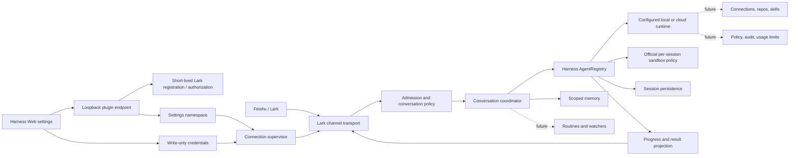

# Deepseek Tag parity roadmap

This document is the implementation ledger for converging on Claude Tag. It is
based on Anthropic's public Claude Tag documentation as of 2026-08-14, the
official DeepSeek Harness plugin and service contracts, and the Feishu/Lark
channel implementation listed under [References](#references).

The goal is behavioral parity where Slack and Lark have equivalent primitives,
not a literal copy of Slack-specific administration.

## Architecture

The stable boundaries are:

- **Transport:** `@larksuite/channel` owns WebSocket lifecycle, normalized
  events, reply targets, deduplication, policy gates, and outbound safety.
- **Conversation:** Lark DM/chat/thread identity maps to an opaque Harness
  session identity. Transport IDs never enter prompts except sender display
  context, and runtime configuration participates in the session fingerprint.
- **Runtime:** Harness `AgentRegistry` is the execution boundary. Local versus
  cloud execution remains a Harness composition choice (sandbox, tools, model,
  and workspace plugins), rather than a second agent loop inside Deepseek Tag.
  Deepseek Tag requires sandbox-aware shell and filesystem providers, resolves
  `read-only` or `workspace-write` from workspace → channel, and records that
  mode on the Harness session before the first tool operation.
- **Control plane:** non-secret configuration belongs to the `deepseek-tag`
  settings namespace and crosses the Web boundary through a same-origin,
  loopback-only plugin route because Harness does not expose third-party
  namespaces through its generic settings API. App Secret values belong only
  to `credentials`.
- **Projection:** Agent events will be projected into acknowledgment, progress,
  tool activity, final response, and artifacts without coupling Lark rendering
  to the Agent loop.
- **Durable state:** session history requires Harness persistence. Place memory uses
  a schema-validated Harness storage domain; routines, subscriptions, and audit
  records will get their own explicit stores instead of being hidden in prompts
  or process globals.

Do not add a plugin-level runtime abstraction until a second execution backend
needs behavior that Harness `AgentRegistry` cannot express. The registry is the
current production seam and already supports whichever local or cloud runtime
the active Web profile composes.

## Phase 1: usable conversation bridge

| Capability | Status | Implementation |
| --- | --- | --- |
| Installable Harness bundle | Done | `dsh.bundle.patch`, disabled-by-default Cordis row, self-contained `prepare` build |
| Dedicated Web configuration | Done | `dsh.client` browser plugin under **Settings > Deepseek Tag** |
| Secret-safe setup | Done | App Secret is write-only through Harness credentials; UI reads configured/writable facts only |
| Guided app setup | Done | One-click official PersonalAgent creation with the complete runtime permission/event bundle, resumable polling, cancellation, expiry, and manual fallback |
| Permission preflight | Done | Actual tenant scopes are checked before launch; all scopes and the message event open in one additive official authorization flow |
| Runtime choices | Done | Model selection comes from the live Harness catalog and working directories use the native chooser; manual model routing appears only when discovery fails |
| Local and cloud-hosted Web runtime | Done | Outbound WebSocket needs no inbound public webhook; Agent execution stays in the composed Harness runtime |
| DM conversation | Done | One durable Agent session per DM chat |
| Group conversation | Done | Direct mention required by default; one session per topic/reply tree, including raw-message recovery for omitted topic ids |
| Thread continuation | Done | Once a topic/reply tree owns a durable session, admitted members can continue without mentioning the bot again |
| Multi-turn context | Done | Every turn resumes one durable thread session while its live Agent is released after idle |
| Runtime lifecycle | Done | One Agent/sandbox activation per request; `AgentHandle.dispose()` releases the live scoped world while session persistence retains the thread |
| Thread isolation | Done | Same-thread turns serialize; sibling topics in one group may run concurrently with separate live Agent scopes |
| Conversation history | Implemented; requires deployment check | First engagement seeds up to 50 prior human messages; a chat-confined read-only tool lists channel roots and opens current or discovered sibling topics through opaque references |
| Place memory | Done | DM isolation, private-group writes, read-only workspace inheritance, and explicit workspace-sharing groups over a durable storage domain |
| Final text response | Done | Last visible assistant message from the completed turn is sent back to the originating Lark message |
| Access policy | Done | DM modes plus DM-user and group-chat allowlists are enforced by the channel SDK |
| Hot configuration | Done | Serialized reconnect, credential rotation, and restoration of the previous good config after a failed replacement |
| Reconnect and delivery safety | Done | SDK keepalive/reconnect, deduplication, per-chat queueing, timeout, proxy, and outbound safety remain enabled |
| Feishu and global Lark | Done | Region selector chooses the correct API domain |
| Live app credential validation | Requires deployment check | Needs a real tenant App ID/App Secret; automated tests and a real Harness Web load cannot prove tenant permissions |

Phase 1 intentionally returns a final text reply. Files are disclosed as not
yet consumed instead of being silently ignored. Guided onboarding and grant
preflight are complete; connection health, progress cards, commands, and
attachments continue in the parity work below.

### Guided setup parity

- **Observed Claude behavior:** the admin page opens on setup until pairing is
  complete, keeps all steps on one resumable page, pairs the chat workspace,
  asks where the Agent may run, and launches only after the prerequisite steps.
- **Lark equivalent:** `registerApp` opens Feishu/Lark's official PersonalAgent
  create page with the app name, bot template, `im.message.receive_v1`, and all
  nine runtime scopes prefilled. The same device flow with `appId + addons`
  performs one additive authorization for an existing app. Scope preflight
  retries through the platform's eventual-consistency window after the admin
  confirms the official page. Feishu does not expose a reliable event inventory
  through this application API, so event delivery is validated by the live
  connection and an actual message rather than presenting a false grant state.
- **Dependencies:** loopback Harness Web, writable Harness settings and
  credentials, access to the Feishu/Lark accounts domain, and an admin allowed
  to create or update the tenant app. GitHub and email-account setup are
  intentionally outside this stage.
- **Security:** setup sessions use random host-owned identifiers, expire or are
  cancelled with the plugin lifecycle, never return App Secret values, disable
  an existing bridge before credential rotation, and expose routes only to
  same-origin loopback requests.
- **Acceptance:** an unconfigured admin can open the official create page with
  one click and return to an automatically paired app; a manually configured
  app shows actual grant status and opens one-click incremental authorization;
  enablement stays unavailable until pairing and required grants pass.

### Conversation history parity

- **Observed Claude behavior:** sessions remain isolated per thread, but may
  read their channel; first engagement partway through a thread includes up to
  50 messages from its start, excluding other bots.
- **Lark equivalent:** `im.v1.message.list` with a `chat` container returns the
  channel timeline and topic roots; each topic's replies require a second read
  with a `thread` container.
- **Dependencies:** the app must have `im:message` (or
  `im:message:readonly`) and, for groups, `im:message.group_msg`, and must
  remain a member of the queried group.
- **Security:** model-facing thread references are opaque, historical content
  is labeled untrusted, and every thread response is verified to belong to the
  triggering chat before projection.
- **Acceptance:** a newly engaged topic receives its earlier human context; an
  Agent can list current-channel history and open a sibling topic, while a
  thread from another chat is rejected.

### Live progress parity

- **Observed Claude behavior:** a task is acknowledged immediately, longer work
  exposes a checklist that changes as steps complete, and the final response
  remains in the originating thread.
- **Lark equivalent:** the bot adds a temporary native working reaction and
  sends one managed CardKit 2.0 entity as a reply. Harness `assistant/chunk`,
  `tool/call`, `tool/result`, and `todo/write` events update that entity in
  sequence; the terminal update closes streaming mode. Feishu currently has no
  published whale `emoji_type`, so the supported `Typing` reaction is used.
- **Dependencies:** `cardkit:card:write`, either
  `im:message.reactions:write_only` or the broader `im:message`, and the existing
  bot reply permission. The guided setup requests the least-privilege pair.
- **Security:** tool arguments, tool output, and model reasoning never enter the
  card. Only tool names and status are projected. Card text is bounded below
  Feishu's message limit; a long final answer continues through the SDK's
  chunked markdown path.
- **Acceptance:** reaction appears while a turn runs and is removed afterward;
  streamed text, actual Agent todos, and tool state update one in-thread card;
  card failure produces the complete plain-text answer instead of losing the
  turn.

## Phase 2 feature ledger

### Scoped Agent access contract

The phase-two configuration plane follows the official Claude Tag separation
between place-bound behavior and service-account access:

- **Observed Claude Tag behavior:** one application identity serves every
  channel. Default, workspace, and channel scopes inherit downward; repository
  grants combine as a union, same-host credentials prefer the narrowest scope,
  and instructions concatenate broad-to-narrow. A thread freezes its model,
  skills, plugins, and instructions at startup, while connection rules are
  enforced for every request. DMs use personal rather than organization
  connections.
- **Lark equivalent:** one Feishu/Lark application is the transport and Agent
  identity. Because one configured app connects to one tenant, installation
  defaults are the Lark workspace scope and an exact `chat_id` is the channel
  scope. A topic/reply root is a session, not an admin credential-binding
  scope. There is no reusable logical-Agent layer. Scope-bound Connections are
  not exposed until Harness can enforce them at every external operation;
  until personal connections exist, DMs have no organization connection path.
- **Dependencies:** Harness settings and domain storage, programmatic Agent
  setup/resume, the Harness credentials seam, the selected sandbox/runtime,
  and a GitHub App installation connection.
- **Security:** admission happens before Agent creation; credential values are
  never stored in scopes, sessions, prompts, cards, or browser
  responses; disabling a scope takes effect before the next Agent creation,
  and a future connection revocation must take effect before the next external
  operation. Official local sandbox enforcement covers file effects only;
  network default-deny remains a separate Agent Proxy requirement.
- **Acceptance:** two Lark groups can resolve different effective
  instructions, models, workspaces, and GitHub repository grants; a sibling
  group and a DM cannot observe or invoke an unbound grant; once live
  authorization exists, the settings UI displays the exact effective access.

### Official sandbox policy integration

- **Observed Claude Tag behavior:** every channel thread runs in an ephemeral
  sandbox. The thread is durable while idle compute is released, and rebuilding
  the sandbox retains conversation state but not files that were never pushed
  or posted. Sandbox egress reaches only Agent Proxy-approved destinations.
- **Lark equivalent:** every Deepseek Tag thread has one durable Harness
  session and a fresh live Agent scope per turn. Workspace sandbox policy
  inherits into groups, a channel may select `read-only` or
  `workspace-write`, and the resolved mode plus immutable session `cwd` are
  frozen in the thread snapshot and applied through Harness `sandbox/mode`.
- **Dependencies:** the standard Harness base composition's
  `sandbox-local`, `sandbox-policy`, sandboxed shell executor, and
  `fs-sandbox`; Agent/session creation and persistence; a future remote
  execution-world provider for true per-thread ephemeral compute.
- **Security:** Deepseek Tag fails closed before connecting to Lark when the
  active shell or filesystem provider does not advertise sandbox enforcement.
  Official local confinement governs file effects and deliberately does not
  claim network isolation, credential isolation, or a microVM boundary.
- **Acceptance:** Workspace and exact-channel policies resolve narrowest-first;
  the chosen mode is recorded before the first tool call, survives resume,
  pre-feature snapshots remain readable, and a bare local shell or filesystem
  prevents plugin activation.

The order column is dependency order, not a promise that unrelated rows must
ship in one release. Every row is intended to land as a production-usable
commit with focused tests and migration-safe settings.

| Order | Claude Tag behavior to match | Deepseek Tag implementation target | Main extension boundary |
| ---: | --- | --- | --- |
| 1 | Guided workspace pairing/setup | **Done:** one-page PersonalAgent creation, host-only credential handoff, manual fallback, access-scope choices, Harness model/directory selectors, cancellation and expiry | Control plane + `registerApp` |
| 2 | Setup/test and troubleshooting feedback | **Permission preflight done.** Live connection state, bot identity, last transport error, and send/receive self-test remain | Transport status projection |
| 3 | Immediate acknowledgment and visible work checklist | **Done:** a working reaction acknowledges intake; a managed CardKit card projects streamed answer text, redacted tool status, and real Agent todos in place, then closes with final status; text reply remains the failure fallback | Agent event projection |
| 4 | Steering a task while it is running | Accept thread follow-ups during a run, distinguish steering from queued next-turn messages, expose stop/restart | Conversation coordinator |
| 5 | Exact user commands | Implement deterministic `!restart`, `!mute`, `!unmute`, feedback, routine listing, and thread handoff equivalents before normal prompting | Command router |
| 6 | Mention, continuation, auto-response, and mute rules | **Continuation done:** initial mention plus no re-mention inside owned threads. Per-chat automatic-response and mute settings remain. | Admission policy |
| 7 | Files and images in prompts | Authenticated download, size/type limits, Harness attachment ingestion, cleanup, and explicit unsupported-type errors | Transport ↔ attachment service |
| 8 | Rich final outputs | Lark files/cards plus Harness deliverables for documents, charts, hosted pages, and repository links | Result/artifact projection |
| 9 | Model choice per thread/channel/DM | **Scope runtime done:** a group inherits the workspace model or overrides it, and each thread freezes the materialized route. Per-thread commands remain. | Runtime policy + settings |
| 10 | Per-channel customization/instructions | **Done for the current behavior surface:** onboarding workspace defaults and exact-channel instructions concatenate deterministically; response mode, model, and workspace resolve narrowest-first and persist in a thread snapshot. The Web UI keeps workspace defaults in Onboarding and edits exact `chat_id` scopes below it. | Scope configuration store |
| 11 | Shared multi-user thread session | Preserve actor attribution, let any admitted member steer, serialize conflicting actions, record who changed what | Conversation coordinator + audit |
| 12 | Channel memory | **Core done:** remember/list/update/forget tool, workspace sharing, private-chat isolation. Admin review/delete UI remains. | Scoped memory store + prompt section |
| 13 | Dedicated agent identity | Separate application identity from invoking user; service-account credentials scoped to org/workspace/private chat equivalents | Identity and access bundles |
| 14 | DM personal identity/connectors | Optional per-user connector resolution for DMs without leaking personal credentials into group sessions | User credential scope |
| 15 | Connections and custom MCP servers | Admin-managed connection catalog, dedicated accounts, typed credential forms, MCP registration, allowed hosts | Harness tools/MCP + credentials |
| 16 | Repository access and agent-authored PRs | Repository allowlist, checkout/setup policy, bot/service identity commits and PRs, link back to source Lark thread | Workspace/runtime provisioning |
| 17 | Organization skills repository | Read/sync scoped skills and let the Agent propose skill changes through reviewable PRs | Harness skill service + repo connection |
| 18 | Scheduled routines | Create/list/pause/delete schedules from a chat; durable ownership, timezone, retry, idempotency, and result delivery | Harness jobs + routine store |
| 19 | Channel watching | Event-driven watch rules with deduplication, rate limits, quiet hours, and explainable trigger state | Lark event subscriptions + jobs |
| 20 | Pull-request subscriptions | Subscribe/unsubscribe from a thread, consume provider events, post state transitions and requested follow-ups | SCM connection + webhook/event worker |
| 21 | Proactive follow-up and stalled-thread checks | Durable delayed checks, completion notifications, actor tagging, cancellation when the condition clears | Jobs + conversation state |
| 22 | Ephemeral isolated sandboxes with durable thread state | **Official sandbox policy connected:** Deepseek Tag requires sandbox-aware Harness shell/fs providers, resolves workspace/channel `read-only` or `workspace-write`, freezes it in the thread snapshot, and applies it through durable `sandbox/mode` before tools run. Idle disposal and durable resume are done. Local Harness confinement is still same-world file policy rather than one cloud sandbox per thread; remote per-thread compute remains. | Harness sandbox/runtime composition |
| 23 | Default-deny network and Agent Proxy | Per-connection host allowlists, SSRF-safe egress, optional fixed proxy/egress, blocked-destination diagnostics | Sandbox network policy |
| 24 | Organization/workspace/private-channel inheritance | **Behavior foundation done:** one paired Lark tenant maps installation defaults → exact Lark group, with thread snapshots and disabled-scope fail-closed behavior. A separate cross-tenant organization root is not represented. Scope-bound Access bundles remain intentionally unavailable until live operation-level authorization exists. | Scope/access resolver |
| 25 | Member/guest/external-chat restrictions | Role and tenant checks before Agent creation; fail closed for externally shared chats unless allowed | Admission + directory integration |
| 26 | Spend limits and threshold alerts | Organization and per-chat budgets, pre-turn refusal, 75/95% alerts, usage summaries | Token meter + durable usage policy |
| 27 | Audit and traceability | Searchable task/routine/network/tool/setting audit; source message and external action correlation | Append-only audit projection |
| 28 | Admin management for workspaces and versions | **Scope editor done:** Onboarding owns connection, workspace defaults, and sandbox policy; the channel surface automatically discovers groups the bot has joined, configures/disables exact channel scopes without exposing raw ids, and previews resolved behavior under one app-wide Agent identity. GitHub access summary, rollout versions, and health inventory remain. | Admin Web surfaces |
| 29 | Retention and deletion controls | Configurable retention for session, memory, routine, credential, and audit domains; disconnect purge workflow | Data lifecycle coordinator |

## Delivery sequence

1. **Conversation UX:** rows 1–9. This closes the largest visible gap: guided
   setup, health, progress, steering, commands, attachments, artifacts, models.
2. **Durable collaboration:** rows 10–14. This adds scope customization,
   multiplayer attribution, memory, and identity without weakening isolation.
3. **Connected proactive work:** rows 15–21. Connections, repositories, skills,
   routines, watchers, and subscriptions share the same credential and job
   foundations.
4. **Runtime and governance:** rows 22–29. Sandbox/network policy, inherited
   access, budgets, audit, admin rollout, and retention complete enterprise
   parity.

## Non-negotiable implementation rules

- A Lark event is admitted before an Agent or sandbox is created.
- Secrets never enter settings, prompts, logs, cards, session events, or browser
  read responses.
- A private-chat memory or credential must never resolve through a public-chat
  scope.
- Every proactive trigger has an owner, visible listing, pause/delete path,
  idempotency key, and audit record.
- A setting or credential rotation either reaches a healthy new connection or
  restores the previous healthy configuration.
- Unsupported input is acknowledged explicitly; it is never silently dropped.
- Runtime-specific capabilities are discovered from Harness services rather
  than inferred from “local” or “cloud” labels.
- Each commit must leave installation, build, and the already-shipped behavior
  production-usable.

## References

Primary specifications and product behavior:

- [DeepSeek Harness: develop a basic plugin](https://deepseek-harness.github.io/deepseek-harness/develop/basic/)
- [DeepSeek Harness source](https://github.com/deepseek-ai/deepseek-harness)
- [Introducing Claude Tag](https://www.anthropic.com/news/introducing-claude-tag)
- [Claude Tag overview](https://claude.com/docs/claude-tag/overview)
- [How Claude Tag works](https://claude.com/docs/claude-tag/concepts/how-it-works)
- [Agent identity](https://claude.com/docs/claude-tag/concepts/agent-identity)
- [Security and data handling](https://claude.com/docs/claude-tag/concepts/security-and-data)
- [Settings map](https://claude.com/docs/claude-tag/concepts/settings-map)
- [Commands](https://claude.com/docs/claude-tag/users/commands)
- [Response control](https://claude.com/docs/claude-tag/users/when-claude-responds)
- [Routines and proactivity](https://claude.com/docs/claude-tag/users/proactivity)
- [Memory](https://claude.com/docs/claude-tag/users/memory)
- [Models](https://claude.com/docs/claude-tag/users/models)
- [Admin setup](https://claude.com/docs/claude-tag/admins/setup-overview)
- [Connections](https://claude.com/docs/claude-tag/admins/add-connections)
- [Spend limits](https://claude.com/docs/claude-tag/admins/set-spend-limit)
- [Audit](https://claude.com/docs/claude-tag/admins/audit)

Implementation references:

- [Lark Coding Agent Bridge](https://github.com/zarazhangrui/lark-coding-agent-bridge)
- [`@larksuite/channel`](https://www.npmjs.com/package/@larksuite/channel)
- [DeepSeek Harness plugin topic](https://github.com/topics/dsh-plugin)
- [dsh-notification browser plugin pattern](https://github.com/omdsh-dev/dsh-notification)
- [Open Managed Agents plugin structure](https://github.com/openma-ai/open-managed-agents)
- [Telegram Harness bridge inspected for comparison](https://github.com/LoserFox/telegram)

The official Harness source is authoritative when a marketplace plugin differs
from the current service contracts.
